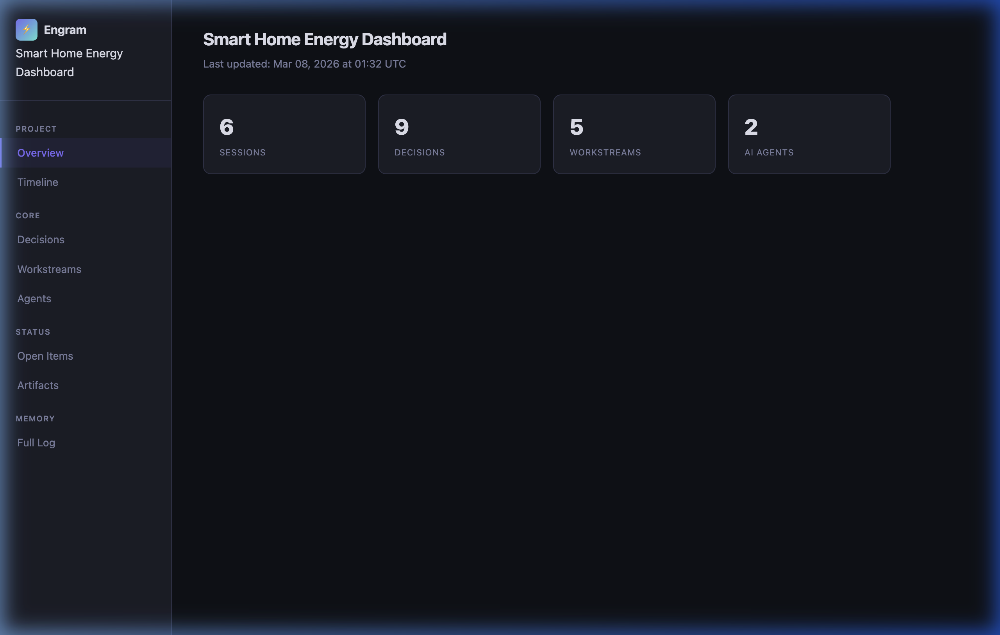
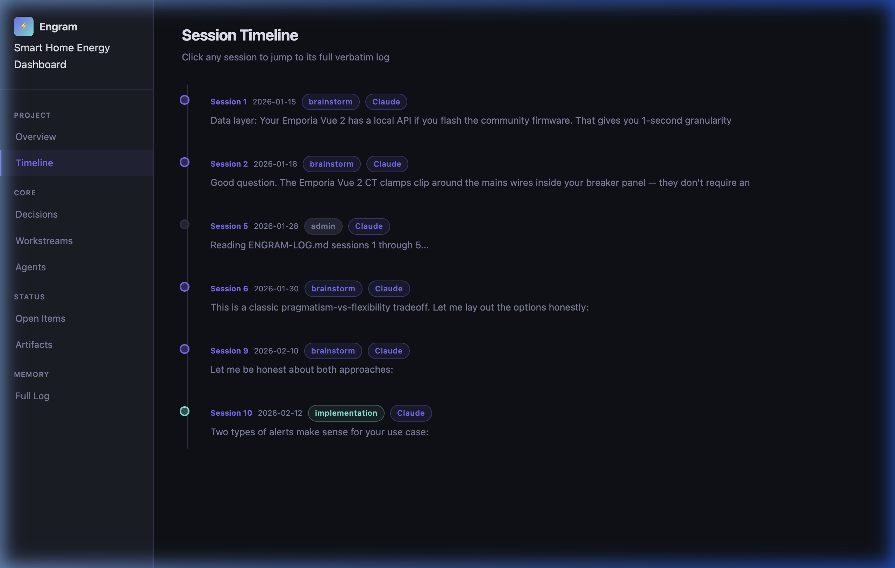
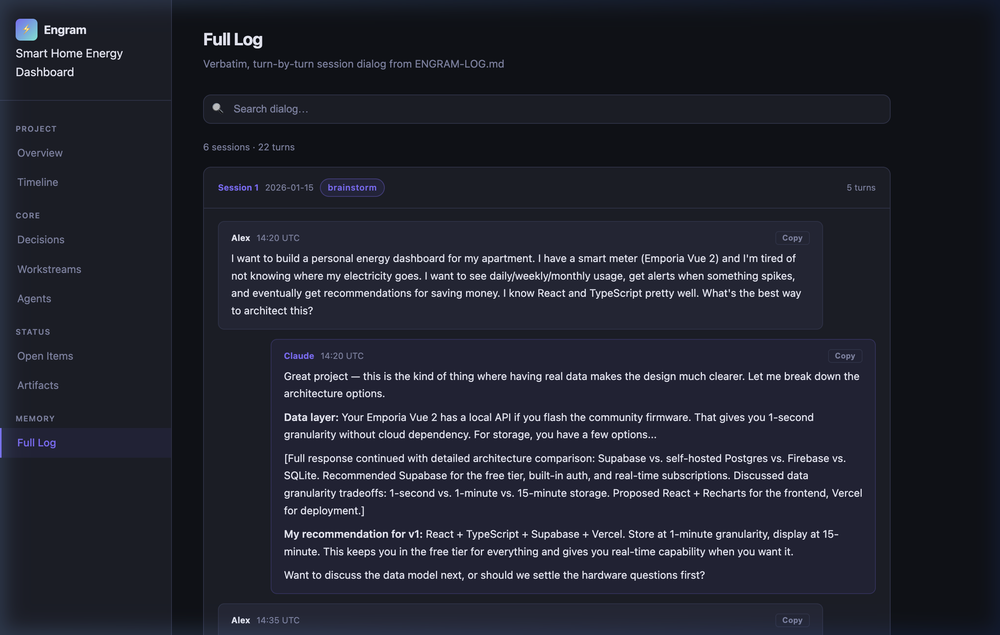

# Engram

**Give your AI a memory.**

[](LICENSE)
[](https://claude.ai)
[](https://chat.openai.com)
[](https://gemini.google.com)
[](https://cursor.sh)

One script. A handful of markdown files. Your AI stops forgetting what you talked about yesterday.

---

## The Problem

You're 12 sessions into a complex project with Claude, ChatGPT, or Gemini. You've made decisions, explored alternatives, rejected dead ends. Then you open a new chat:

> "I'd be happy to help! What are you working on?"

Everything is gone. You re-explain. The AI re-suggests things you already tried. You waste an hour getting back up to speed.

Or you try to feed it a massive log of past conversations — and the AI loses its context window halfway through and forgets what it just read.

## The Fix

Engram is a lightweight protocol that gives any AI persistent memory across sessions, devices, and platforms. A structured set of markdown files the AI reads at session start and updates as you work.

**No database. No API. No plugins. Just markdown and a protocol.**

The core insight: **the AI doesn't need to read 50 pages of logs. It needs an index and a grep.**

---

## Quick Start

```bash
# Download and run
curl -O https://raw.githubusercontent.com/ecomxco/engram/main/init-engram.sh
chmod +x init-engram.sh
./init-engram.sh
```

Or with arguments:

```bash
./init-engram.sh --name "My Research" --author "Jane" --desc "Exploring emergent systems"
```

Then open an AI session in that folder. The AI reads `STATE.md`, picks up where you left off, and follows the protocol automatically.

---

## How It Works

```
your-project/
├── CLAUDE.md               ← Operating instructions the AI reads first
├── STATE.md                ← "Where we are right now" + sync thresholds
├── ENGRAM-LOG.md           ← Every session logged as structured YAML
├── ENGRAM-INDEX.md         ← Table of Contents (context window protection)
├── ENGRAM.md               ← Actionable summary: tasks, problems, decisions
├── DECISIONS.md            ← Why we chose X over Y (prevents re-litigating)
├── AGENTS.md               ← Multi-AI registry and handoff rules
├── HANDOFF.md              ← Dense resume doc for session/device switches
├── update-visualizer.sh    ← Regenerates VISUALIZER.html from live data
├── engram-watch.sh         ← Background watcher: auto-updates dashboard
├── VISUALIZER.html         ← Interactive browser-based project dashboard
└── .agents/workflows/      ← 13 workflow definitions the AI follows
```

**The layered retrieval model:**

| Layer | File | Purpose | When Read |
| --- | --- | --- | --- |
| Hot | `STATE.md` | Current position + priorities | Every session |
| Hot | `ENGRAM.md` | Open problems, tasks, decisions | Every session |
| Warm | `HANDOFF.md` | Dense resume for fast restart | Session start (if exists) |
| Cold | `ENGRAM-INDEX.md` | TOC → exact log timestamps | On-demand grep |
| Archive | `ENGRAM-LOG.md` | Verbatim source of truth | Reconcile only |

The AI **never** loads the full log at session start. It reads at most two files (~1-3K tokens). This scales to hundreds of sessions without hitting context limits.

---

## Context Engineering

This is the core technical claim. Here's exactly how it works and how well it holds up.

### Token Economics

| What you're loading | Approx. tokens | When |
| --- | --- | --- |
| `STATE.md` | 400–1,200 | Every session |
| `ENGRAM.md` | 600–1,800 | Every session |
| **Session boot (2 files)** | **~1,000–3,000** | Every session |
| `ENGRAM-INDEX.md` + targeted grep | 200–800 | On-demand |
| `ENGRAM-LOG.md` at 10 sessions | 15,000–40,000 | Reconcile only |
| `ENGRAM-LOG.md` at 50 sessions | 80,000–200,000 | Basically never |

**The result:** a session cold-start costs roughly 10–15× fewer tokens than loading a raw log of the same project history. The savings compound as the project grows.

### How ENGRAM-INDEX.md Enables Targeted Retrieval

The index maps semantic tags to exact timestamps in the log. Instead of reading everything, the AI finds the tag and reads only the matching block:

```yaml
# ENGRAM-INDEX.md excerpt
[database_choice]: 2026-01-22T14:32:00Z — Session 3, turn 7
[auth_model]:      2026-02-05T09:18:00Z — Session 6, turn 2
[rate_limiting]:   2026-02-18T11:44:00Z — Session 8, turn 5
```

To recall why a decision was made, the AI doesn't scan 40 pages. It:

1. Looks up the tag in the index (200 tokens)
2. Reads the specific YAML block by timestamp (300–500 tokens)
3. Answers with full context intact

### What's Guaranteed vs. Best-Effort

| Behavior | Guaranteed by | Reliability |
| --- | --- | --- |
| Session boot reads ≤2 files | `new-session.md` workflow definition | High — enforced by protocol |
| Log entries are structured YAML | `autonomic-engram-logger.md` workflow | High — AI follows the template |
| Verbatim prompt/response accuracy | Best-effort | ~80% in practice — AIs paraphrase under load |
| Index tags are correctly placed | Best-effort | Good — degrades if AI skips checkpoints |
| Reconcile catches drift | `reconcile.md` workflow | High — rebuilds from ground truth |

**The honest answer:** the session boot and checkpoint mechanics are protocol-enforced and work consistently. Verbatim log fidelity is the main variable — some AIs are more faithful than others, and all of them will paraphrase long responses. The reconcile workflow is specifically designed to correct index drift before it compounds.

---

**Session 1** — You brainstorm. The AI logs the interaction as structured YAML with a confidence score, deliverables, and identified blindspots.

**Session 5** — The sync counter in `STATE.md` hits its threshold. Without you asking, the AI reads recent logs, distills the open problems and tasks, and silently rebuilds `ENGRAM.md` before answering.

**Session 10** — You can't remember why you chose a certain approach. The AI reads `ENGRAM-INDEX.md`, finds the `[architecture_choice]` tag, greps the exact 12-line YAML block from Session 3. Context preserved.

**Session 15** — You bring in a second AI for a review. It reads the same files, logs its critique with model attribution, and you process its findings back into the decision log.

---

## The Dashboard

Run `./update-visualizer.sh` once (or `./engram-watch.sh --daemon` to keep it live) and open `VISUALIZER.html` in any browser. No server. No internet required.

**Overview** — sessions, decisions, workstreams, and agents at a glance:



**Session Timeline** — every session dated, tagged by mode and agent, with a preview of the opening message. Click any session to jump to its verbatim log:



**Full Log** — searchable, verbatim turn-by-turn dialog from `ENGRAM-LOG.md`. Click any bubble to copy the exact text to your clipboard:



---

## Quick Commands

Say these in any session:

| Command | What Happens |
| --- | --- |
| **`checkpoint`** | Syncs log, summary, and state |
| **`status`** | 4-8 line summary from STATE.md only |
| **`reconcile now`** | Full rebuild of ENGRAM.md from the raw log |
| **`handoff`** | Writes HANDOFF.md for fast context restore |
| **`rotate log`** | Archives ENGRAM-LOG.md, starts fresh |
| **`log this decision`** | Logs a single decision mid-session |
| **`agent review`** | Cross-platform review protocol with second AI |
| **`context pressure`** | Full handoff ceremony when context window is tight |
| **`git commit`** | Atomic snapshot of engram files to git |

> The State Manifest counter in `STATE.md` triggers checkpoints automatically in the background. These commands force an immediate sync.

---

## Session Visualizer

Engram ships with an interactive project dashboard:

- **Session Timeline** — every session as a clickable node, color-coded by mode
- **Decision Log** — searchable cards with alternatives considered and rationale
- **Workstream Dashboard** — progress tracking and blockers
- **Agent Activity** — which AI models participated across sessions
- **Open Items** — P0/P1/P2 problems, tasks, and open questions

**To update with live data from your project:**

```bash
./update-visualizer.sh                     # current directory
./update-visualizer.sh --dir ~/my-project  # any project
```

**To keep the dashboard always current ("install and forget"):**

```bash
./engram-watch.sh --daemon   # starts a background watcher
open VISUALIZER.html          # open once — it auto-refreshes every 30s
```

The watcher monitors `ENGRAM-LOG.md`, `ENGRAM.md`, `STATE.md`, `DECISIONS.md`, and `AGENTS.md`. Any change triggers a re-generation automatically. Stop it with `./engram-watch.sh stop`.

No server. No build step. Open the HTML file directly.

---

## Works With Any AI

Every log entry is attributed to the model that generated it. Engram works across:

| Agent | How to Use |
| --- | --- |
| **Claude** (claude.ai, Claude Code) | Reads `CLAUDE.md` natively as project instructions |
| **ChatGPT** | Paste or upload `STATE.md` + `ENGRAM.md` at session start |
| **Gemini** | Upload files or paste into the context window |
| **Grok** | Paste `STATE.md` + `ENGRAM.md` |
| **Cursor** | Open the project folder — reads `CLAUDE.md` automatically |
| **Antigravity** | Natively supported — runs the full workflow suite autonomously |
| **Any local model** | Same approach: file-based context injection |

Multi-AI workflows are a first-class use case. The `AGENTS.md` registry tracks every model that participates, with session attribution, role assignment (primary / reviewer), and the handoff protocol.

---

## Before and After

**Before (session 12, no Engram):**
> **You:** "Last time we discussed the caching strategy—"
> **AI:** "I don't have context from previous conversations. Could you summarize?"

**After (session 12, with Engram):**
> **AI:** "Reading STATE.md... Session 12. Last session we finalized the Redis caching approach (Decision 7 in DECISIONS.md) and opened a thread on rate limiting — two open questions: token bucket vs. sliding window, and what the default rate should be. Pick up there?"

See [`examples/after-10-sessions/`](examples/after-10-sessions/) for what a real project looks like.

---

## Installation

**Option 1: curl (recommended)**

```bash
curl -O https://raw.githubusercontent.com/ecomxco/engram/main/init-engram.sh
chmod +x init-engram.sh
./init-engram.sh
```

**Option 2: Clone**

```bash
git clone https://github.com/ecomxco/engram.git
cd engram
./init-engram.sh --dir ~/my-project
```

**Option 3: Manual**
Copy the files from [`examples/after-10-sessions/`](examples/after-10-sessions/) into your project and fill them in. The architecture is the value, not the script.

### CLI Options

```
./init-engram.sh [OPTIONS]

  --name NAME     Project name
  --author NAME   Author name
  --email EMAIL   Author email (optional)
  --desc DESC     One-line project description
  --dir DIR       Target directory (default: current dir)
  --force         Overwrite existing files without prompting
  -h, --help      Show help
```

---

## Design Principles

1. **Preserve everything.** The log is append-only. Nothing from any session is lost.
2. **Separate raw from processed.** The verbatim log is the source of truth. The summary is a convenience layer rebuilt periodically.
3. **State is portable.** Works across devices, AI platforms, and internet outages. It's just files.
4. **Context engineering over brute force.** The AI reads two small files instead of the full history.
5. **Be honest about AI limitations.** Verbatim logging is best-effort (~80% fidelity). The checkpoint system catches the rest.
6. **Minimize maintenance burden.** The AI does the bookkeeping. You just say "checkpoint."

---

## FAQ

**Does this work with the free tier?**
Yes. Plain markdown — any AI that can read text can use this.

**How large do the files get?**
The log grows with usage. At ~50KB or 15-20 sessions, `rotate log` archives it and starts fresh. Summary and state files stay small by design.

**Can I use this for a team?**
Designed for solo or small-team use with one active device. Git works for version control, but expect merge conflicts in `STATE.md` if multiple people edit simultaneously.

**What if I switch AI models mid-project?**
First-class use case. Every log entry is tagged with the model that generated it. The `AGENTS.md` handoff protocol ensures any model can pick up the thread.

**Is this overkill for a quick project?**
If your work wraps up in one session, yes. Engram is for projects that span days, weeks, or months — where the cost of lost context is real.

---

## Roadmap

See [ROADMAP.md](ROADMAP.md) — CLI tool, MCP server, project templates, cross-project memory, and more.

## Contributing

Issues and PRs welcome. If you've adapted Engram for a specific workflow (academic research, architecture, creative writing, autonomous agents), open an issue — contributions are incorporated into the example library.

## License

MIT — see [LICENSE](LICENSE).

---

## Origin

Built after losing context across dozens of sessions and re-explaining the same decisions to different AI models. Four different AI models reviewed and stress-tested it across two major versions.

The result is the most practical answer I've found to the AI memory problem.

— Jim · [eCom XP LLC](https://ecom-x.com) · <jim@ecom-x.com>
